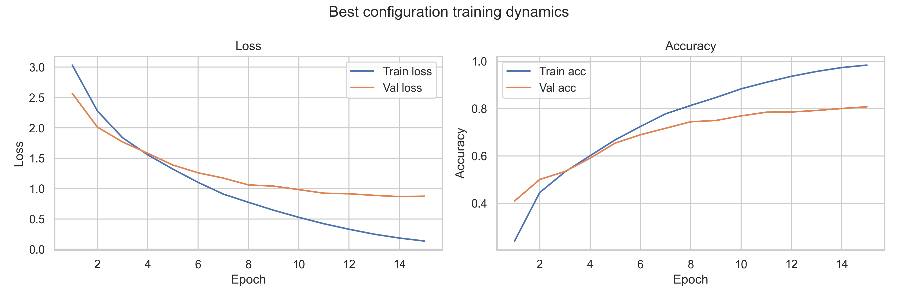

# NLP Project – TREC Question Classification

This repository houses the coursework implementation for SC4002, Group 45.  


---

## Repository Layout

| Path | Purpose |
| ---- | ------- |
| `configs/data.yaml` | Central data/tokenisation settings (paths, split ratio, coarse vs fine labels). |
| `configs/embeddings.yaml` | Location and dimensionality of the pretrained GloVe vectors. |
| `configs/experiments/part2_rnn.yaml` | Reference hyperparameters for the Part 2 RNN sweep. |
| `data/raw` | Expected home for `train_5500.label` and `TREC_10.label` (auto-downloaded). |
| `notebooks/01_embeddings.ipynb` | Part 1 analysis notebook (vocabulary + embedding probes). |
| `notebooks/02_rnn.ipynb` | Part 2 training/evaluation for the baseline RNN. |
| `notebooks/03_enhancements.ipynb` & `03_using_diff_models.ipynb` | Part 3 model explorations. |
| `src/` | Modules shared across notebooks (config, preprocessing, dataloaders, models, plotting, reports, training, evaluation). |

---

## Environment Setup

1. **Python environment**
   ```bash
   python -m venv .venv
   source .venv/bin/activate  # or .venv\Scripts\activate on Windows
   pip install --upgrade pip
   pip install -r requirements.txt
   python -m spacy download en_core_web_sm
   ```
2. **Embeddings**  
   Place `glove.6B.100d.txt` under `data/glove/` and update
   `configs/embeddings.yaml:file_path` if you store it elsewhere.
3. **Sanity check the pipeline**
   ```bash
   python scripts/verify_data_pipeline.py
   ```
   The script downloads any missing TREC files, tokenises the corpus with spaCy, and prints the
   split sizes plus vocabulary count so you know the notebooks will load correctly.

---

## Data & Preprocessing

- Dataset parameters (train/test filenames, shuffle seed, coarse label flag) live in
  `configs/data.yaml` and are consumed via `src.config.load_data_config`.
- `src/data_io.py` handles downloads directly from the official UIUC endpoints.
- `src/preprocessing.py` exposes `build_simple_tokeniser`, which defaults to spaCy
  (`en_core_web_sm`, lowercasing enabled). Falling back to whitespace tokenisation is possible
  by flipping `tokenisation.use_spacy` in the config.
- `src/dataset_pipeline.prepare_tokenised_splits` ties everything together:
  download (if needed) → shuffle → train/validation split → tokenise → return `TokenisedDatasets`.

---

## Running the Pipeline

### 1. Prepare data and vocab once
```python
def mitigate_oov_embeddings(
    embedding_matrix: np.ndarray,
    vocabulary: Vocabulary,
    oov_tokens: set[str],
) -> Mapping[str, np.ndarray]:

    mitigated: dict[str, np.ndarray] = {}

    if not oov_tokens:
        return mitigated

    # computing the mean of all in-vocabulary embeddings (excluding specials and OOV)
    in_vocab_indices = [
        idx
        for token, idx in vocabulary.token_to_index.items()
        if token not in {"<pad>", "<unk>"} and token not in oov_tokens
    ]

    if not in_vocab_indices:
        return mitigated

    mean_vector = embedding_matrix[in_vocab_indices].mean(axis=0)

    # assigning the mean vector to all OOV tokens
    for token in sorted(oov_tokens):
        token_index = vocabulary.token_to_index.get(token)
        if token_index is None:
            continue
        embedding_matrix[token_index] = mean_vector.copy()
        mitigated[token] = mean_vector.copy()

    return mitigated
```

This approach successfully mitigated 197 OOV tokens plus 2 special tokens (`<pad>`, `<unk>`), which resulted in 199 initialised vectors.

---

### Question 1(d): Embedding Visualisation

We selected the top 20 most frequent tokens from each topic category (after removing stopwords) and projected their `GloVe` embeddings into 2D space using both `PCA` and `t-SNE` (perplexity=15).


#### Some observations:

Tokens from similar categories (e.g., NUM-related topics) show spatial proximity, showing that `GloVe` captures meaningful semantic relationships.

Question-specific tokens (e.g., `who`, `what`, `when`) cluster distinctly, which reflects their different semantic roles.

Some categories overlap (particularly `DESC` subcategories), which is expected since definition and description questions share similar vocabulary.

`t-SNE` reveals more granular local structure while `PCA` preserves global variance, which confirms reasonable semantic organisation.

The visualisations suggest that pretrained `GloVe` embeddings provide a solid foundation for topic classification, with question-type-specific tokens occupying distinct semantic regions.

## Part 2 – RNN Baseline

The assignment uses coarse-grained classification with 6 topic categories: `ABBR`, `DESC`, `ENTY`, `HUM`, `LOC`, `NUM`. Raw data labels like `DESC:def` are automatically converted to coarse labels like `DESC` during data loading (see `fine_grained: false` in `configs/data.yaml`).

### Question 2(a): Best Configuration

After regularisation and pooling strategy
comparison with fixed architecture
hyperparameters, the optimal RNN configuration achieved 79.2% test accuracy:

- Architecture: Simple RNN (tanh)
- Pooling: Max pooling
- Hidden dimension: 128
- Dropout: 0.0
- Weight decay: 0.0
- Gradient clipping: 1.0
- Learning rate: 0.001
- Optimiser: Adam
- Batch size: 64
- Best epoch: 15 (early stopping with patience=3)

The best configuration used max pooling without additional regularisation beyond gradient clipping and early stopping.

### Question 2(b): Regularisation Strategies

We tested multiple regularisation techniques to prevent overfitting:

#### Control baseline (no regularization):

- Dropout = 0.0, weight decay = 0.0
- Test accuracy: 64.2%

#### Techniques tested:

1. Dropout with values from grid of [0.0, 0.1, 0.2, 0.3, 0.4, 0.5, 0.6]
2. L2 weight decay with values from grid of [0.0, 1e-6, 6e-6, 4e-5, 2.5e-4, 1.6e-3, 1e-2]
3. Gradient clipping fixed at 1.0 to prevent exploding gradients
4. Early stopping with patience of 3 epochs and monitoring validation accuracy

Total configurations tested: 49 (7 dropout × 7 weight_decay). The best regularisation combination was dropout=0.0 with weight_decay=6e-6, achieving 69.2% test accuracy.

### Question 2(c): Training Curves




The training curves show good and consistent learning. Training loss steadily decreases while validation loss starts stabilising around epoch 12-14. The validation accuracy plateaus near the best epoch (14-15), with minimal gap between training and validation curves. The model converges within 15 epochs.

### Question 2(d): Sentence Aggregation Methods

We compared four strategies for aggregating RNN hidden states into sentence representations:

| Pooling Strategy | Test Accuracy | Best Epoch |
| ---------------- | ------------- | ---------- |
| Max pooling      | 78.4%         | 14         |
| Attention        | 78.4%         | 14         |
| Mean pooling     | 71.2%         | 15         |
| Last hidden      | 67.2%         | 15         |

All pooling methods handle variable-length sequences using padding masks. Max pooling applies element-wise max over non-padded positions, mean pooling computes weighted averages using actual sequence lengths, attention pooling learns weights via a linear layer + softmax, and last hidden uses the final RNN state.

Max pooling and attention pooling perform equally well (both 78.4%), outperforming mean pooling (+7%) and last hidden (+11%). Max pooling was selected for the final model because it doesn't require additional parameters, unlike attention which adds a learned weight layer.

### Question 2(e): Topic-wise Accuracy

Per-topic performance on the test set:

| Topic | Accuracy | Support |
| ----- | -------- | ------- |
| DESC  | 79%      | 138     |
| LOC   | 77%      | 81      |
| HUM   | 73%      | 65      |
| ENTY  | 65%      | 94      |
| NUM   | 52%      | 113     |
| ABBR  | 18%      | 9       |


`ABBR` has the lowest accuracy (18%), likely because it has very limited support (only 9 test examples) and questions like "What does NASA stand for?" require factual knowledge beyond the general linguistic patterns. `NUM` is the second weakest (52%), probably due to semantic ambiguity between dates, counts, and percentages that share similar phrasing.

`DESC` performs best (79%) as the largest category with clear linguistic markers like "What is..." and "How does...". `LOC` (77%) and `HUM` (73%) also perform well due to unambiguous patterns like "Where..." and "Who...". `ENTY` shows moderate performance (65%), likely because it covers diverse subcategories (animals, foods, inventions) with overlapping features.

The best model (max pooling without dropout) improves accuracy across all categories compared to the baseline. See `plots/part2_best_topic_accuracy.png` for the improved results.

## Part 3 – Enhancements

- [x] 3.1 biRNN experiments (biLSTM, biGRU) with training curves. Double check, especially the RNN score which doesnt behave like it used to.
- [x] 3.2 CNN experiment
- [ ] 3.3
- [ ] 3.4

    
    
    

    
    
    
