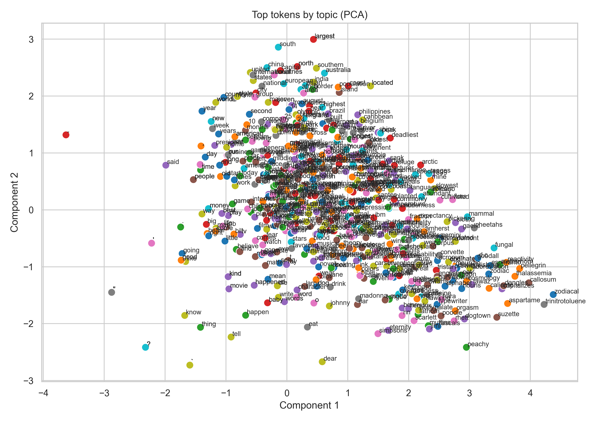
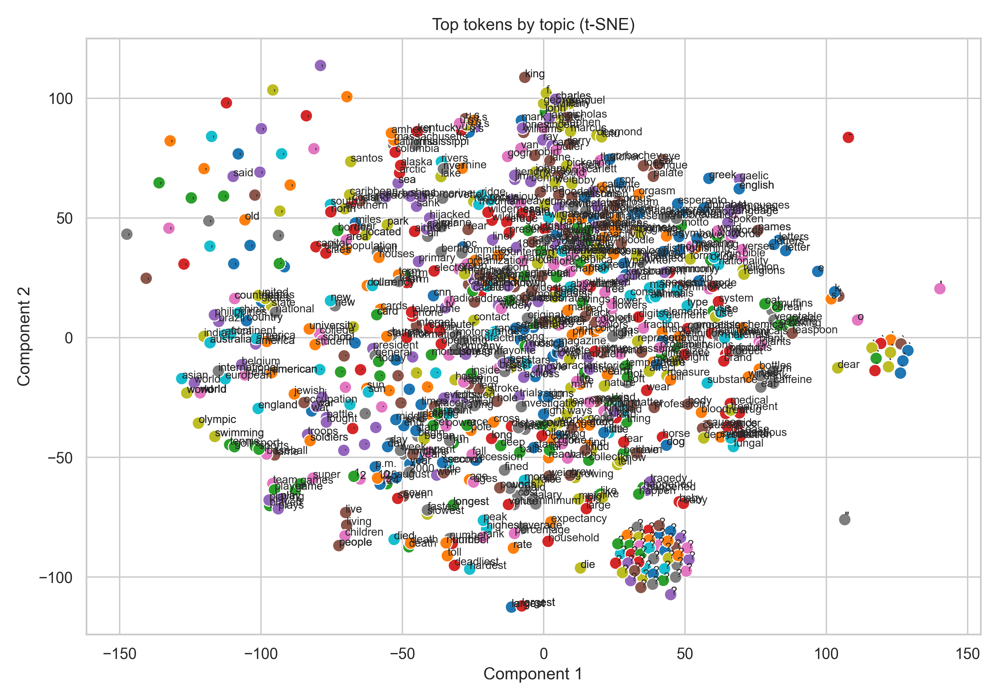
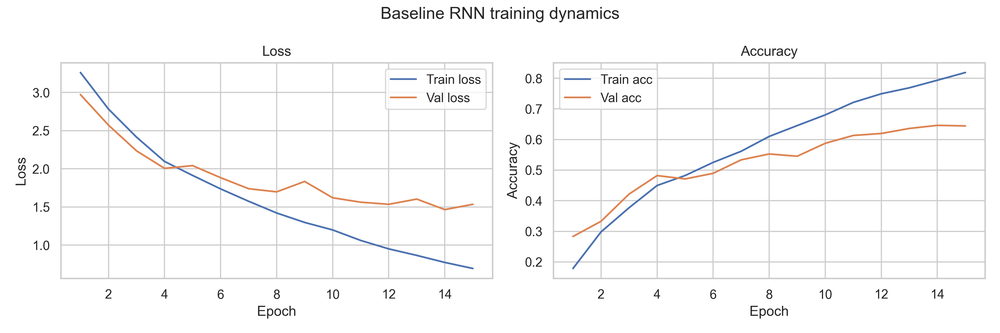
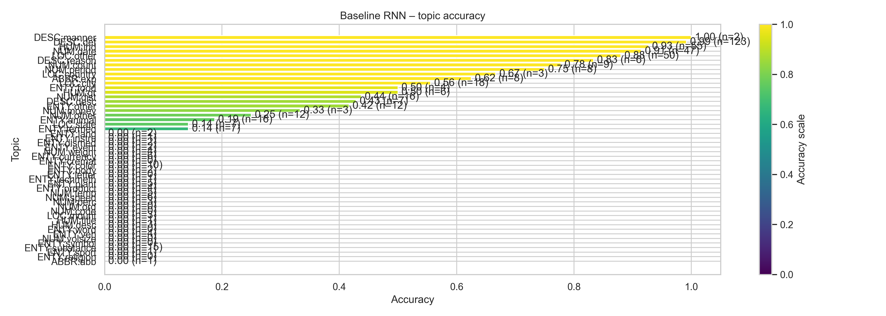
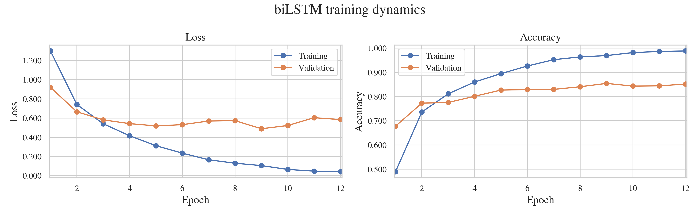
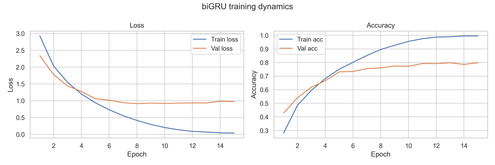
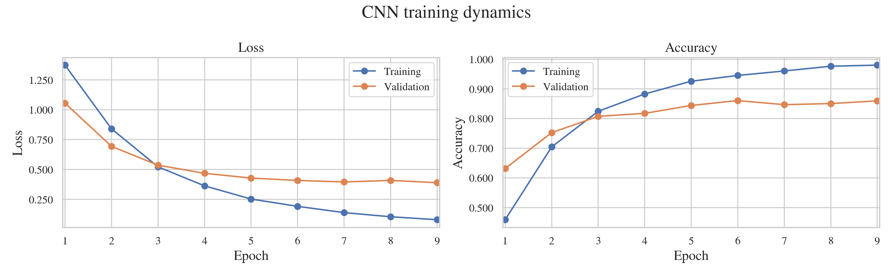
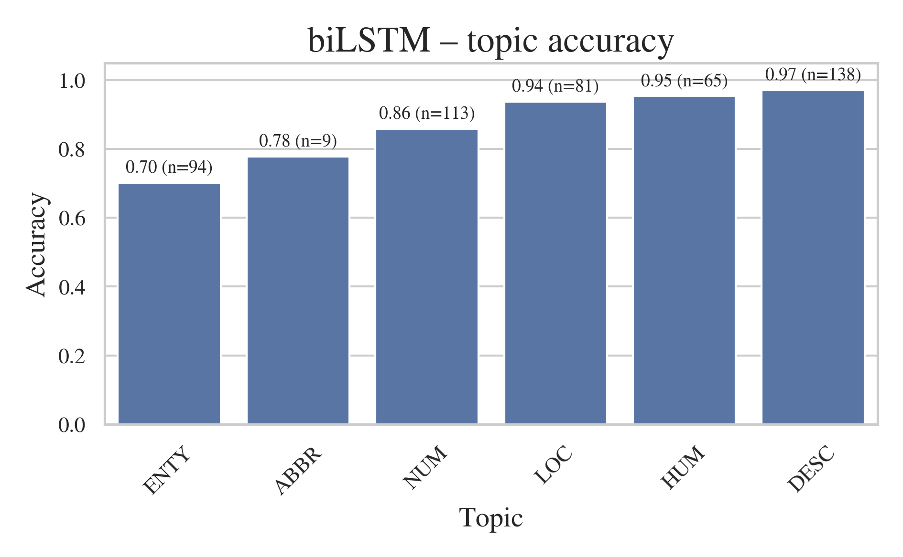
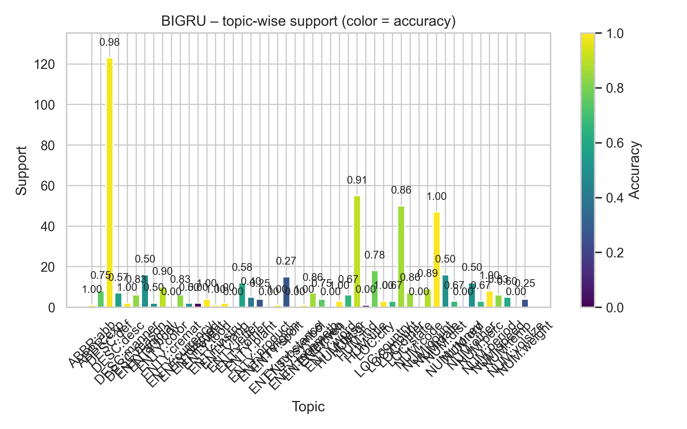
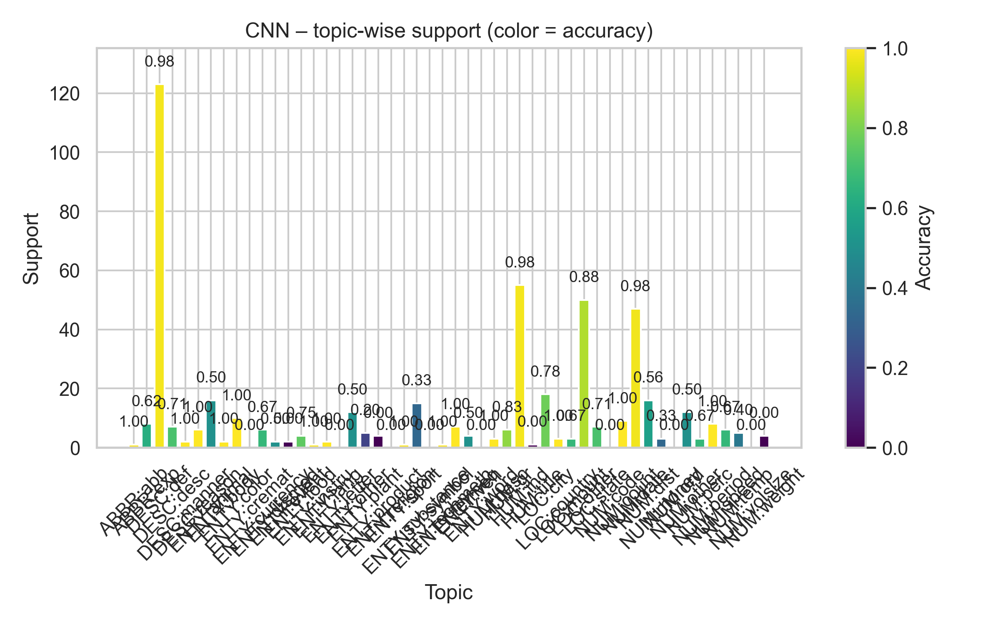

# NLP Group 45

**Note:** I am not very sure about every result but thought this could work as a skeleton for further development? 

## Part 0 - Overview
Did a draft of the questions below, mainly to structure the repo. Feel free to change whatever. 

## Part 1 – Word Embedding 
- [x] 1(a) Vocabulary size captured (`01_embeddings.ipynb`).
- [x] 1(b) OOV counts per topic computed.
- [ ] 1(c) Did a placeholder mitigation where I assigned the mean embedding to OOV words. If someone comes up with something smart, please add. 
- [x] 1(d) Top-token embeddings visualised. Looks ok but prob need refinement. Maybe they look dubious because of the OOV mitigation strategy? 

    
    

## Part 2 – RNN Baseline 
- [x] 2(a) Best configuration (see `02_rnn.ipynb`).
- [x] 2(b) Regularisation sweep complete with "no regularisation" as control. Don't know about this one but think we have an ok grid?
- [x] 2(c) Training curves. Validation accuracy sort of plateaus near the best epoch, maybe double check this.
- [x] 2(d) Sentence pooling strategies compared (`pooling_df`). Did mean, max and attention variants. They seem to be improving the accuracy.
- [x] 2(e) Topic-wise accuracy.

    
    

## Part 3 – Enhancements 
- [x] 3.1 biRNN experiments (biLSTM, biGRU) with training curves. Double check, especially the RNN score which doesnt behave like it used to. 
- [x] 3.2 CNN experiment
- [ ] 3.3 
- [ ] 3.4 

    
    
    

    
    
    

